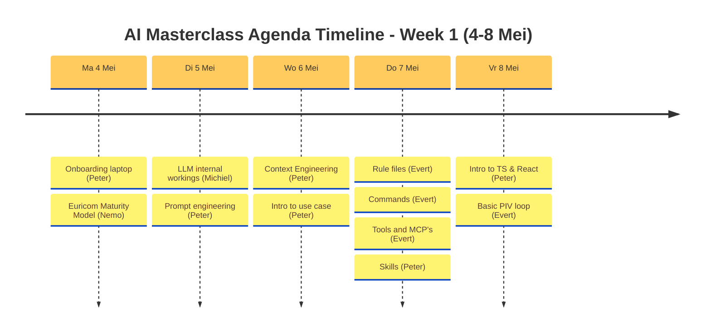

```mermaid
%%{init: { 'theme': 'base', 'timeline': { 'disableMulticolor': true } }}%%
timeline
    title AI Masterclass Agenda Timeline - Week 1 (4-8 Mei)

    Ma 4 Mei : Onboarding laptop (Peter)
             : Euricom Maturity Model (Nemo)
    Di 5 Mei : LLM internal workings (Michiel)
             : Prompt engineering (Peter)
    Wo 6 Mei : Context Engineering (Peter)
             : Intro to use case (Peter)
    Do 7 Mei : Rule files (Evert)
             : Commands (Evert)
             : Tools and MCP's (Evert)
             : Skills (Peter)
    Vr 8 Mei : Intro to TS & React (Peter)
             : Basic PIV loop (Evert)
```