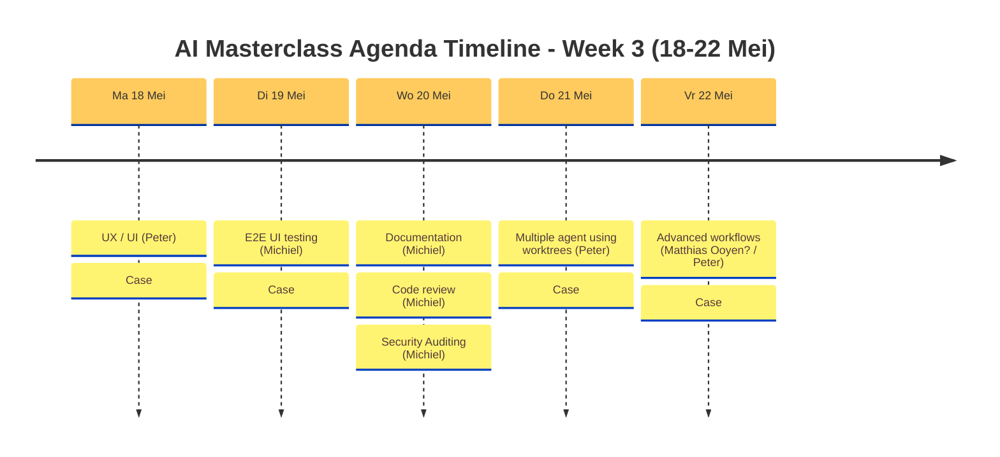

```mermaid
%%{init: { 'theme': 'base', 'timeline': { 'disableMulticolor': true } }}%%
timeline
    title AI Masterclass Agenda Timeline - Week 3 (18-22 Mei)

    Ma 18 Mei : UX / UI (Peter)
              : Case
    Di 19 Mei : E2E UI testing (Michiel)
              : Case
    Wo 20 Mei : Documentation (Michiel)
              : Code review (Michiel)
              : Security Auditing (Michiel)
    Do 21 Mei : Multiple agent using worktrees (Peter)
              : Case
    Vr 22 Mei : Advanced workflows (Matthias Ooyen? / Peter)
              : Case
```